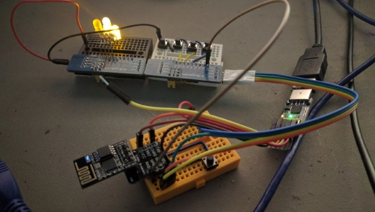
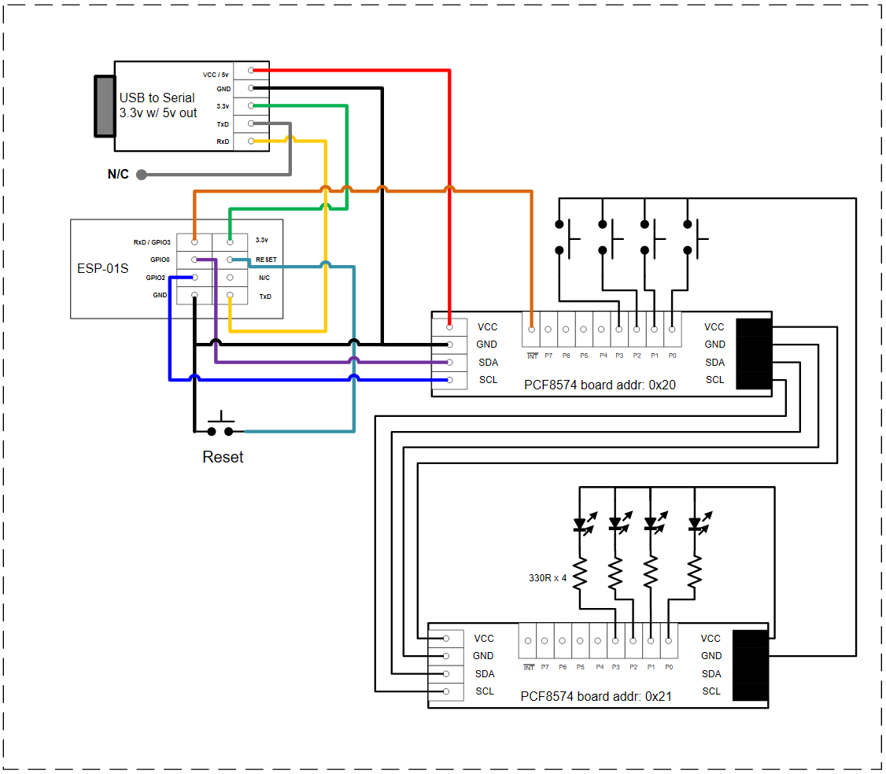
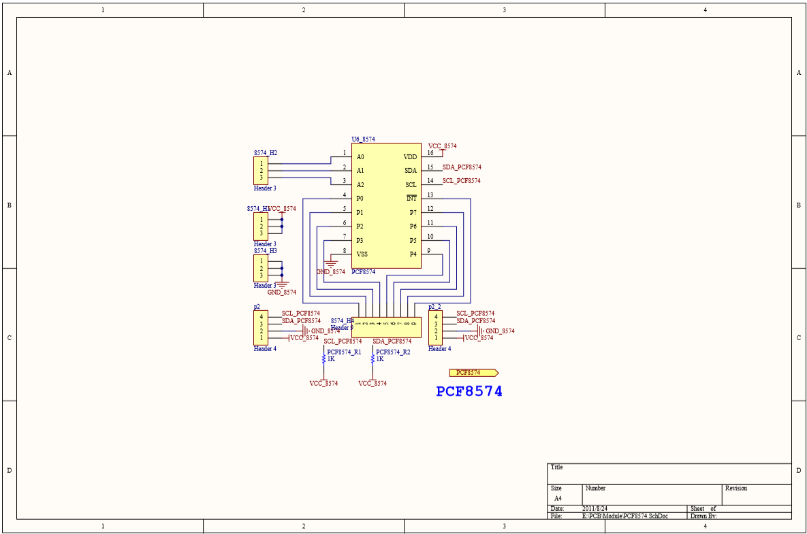
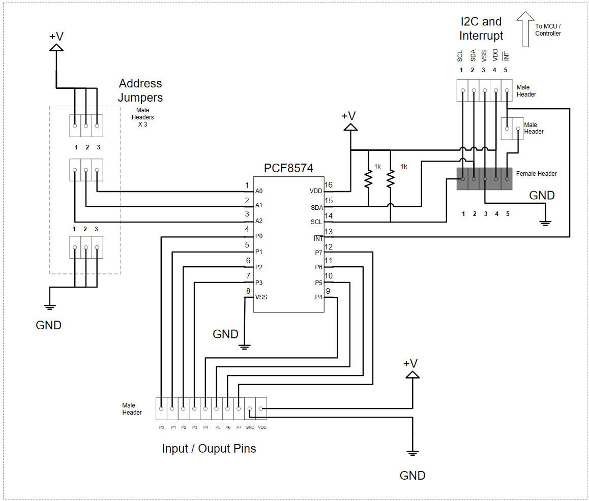

# esp8266-PCF8574

This repository contains an ESP8266 sketch that communicates over I2C to a breakout board that contains a PCF8574 (*a remote 8-bit I/O expander for the I2C bus*).

# History

This project started out as a *proof of concept* for another project that required additional digital inputs and outputs. The platform I was working with is an ESP-01S, and the PCF8475 seemed to be a perfect match.

I researched a number of PCF9475 options including wiring up my own circuit. However I found a board that was configured almost as I needed.

# Overview

There are 5 basic components in this project - 

* ESP-01S
* 2 of : PCF8574 breakout boards / expansion modules
* 4 of : push button switches
* 4 of each : LEDs and 330R resistors
* Software!

The rest is wire, breadboard(s), and a USB<->TTL converter board. And you should already have what you need to program your ESP8266. This project was originally built using an ESP-01S but I'm reasonably sure that most *any* ESP8266 platform should work with minor modifications to the code.

<p align="center">
  
</p>

## Running the Sketch

First you'll have to build the project [circuit](#circuit) before downloading and running the sketch. After downloading the compiled sketch open the IDE console and push some of the buttons. You should see something like this - 

```
testCount - val : 00001011
testCount - val : 00001100
testShift - val : 00000001
testShift - val : 00000010
testShift - val : 00000100
testRead - val : 11111101 last : 11111111
testShift - val : 00001000
testRead - val : 11111111 last : 11111101
testShift - val : 00000001
testShift - val : 00000010
testShift - val : 00000100
testRead - val : 11111110 last : 11111111
testShift - val : 00001000
testShift - val : 00000001
testRead - val : 11111111 last : 11111110
testShift - val : 00000010
testShift - val : 00000100
testShift - val : 00001000
testShift - val : 00000001
testShift - val : 00000010
testShift - val : 00000100
testCount - val : 00001110
testRead - val : 11110011 last : 11111111
testCount - val : 00001111
testCount - val : 00000000
testCount - val : 00000001
testRead - val : 11111111 last : 11110011
testCount - val : 00000010
testCount - val : 00000011
testCount - val : 00000100
```

* In lines with `testCount` and `testShift` a `1` will represent an LED that is **on**
* In lines with `testRead` a `0` represents a button that is pressed(*closed*)

## Sketch Overview

Here are the pieces - 

* `esp8266-PCF8574.ino` - main program logic
* `pcf8574.h` and `pcf8574.cpp` - a wrapper around the I2C buss and the *PCF8574 library*
* `pcf8574-test.h` and `pcf8574-test.cpp` - I/O test functions used by the sketch

The *imporatnt* piece is the PCF8574 library that came from [WereCatf/PCF8574_ESP
](https://github.com/WereCatf/PCF8574_ESP) - 

* `/src/pcf8574/pcf8574_esp.h` and `/src/pcf8574/pcf8574_esp.cpp`

## Circuit

Here's a basic diagram of the circuit used in this project - 

<p align="center">
  
</p>

<p align="center">
  <a href="#running-the-sketch" alt="return to Running the Sketch" title="return to Running the Sketch"><i>return to "Running the Sketch"</i></a>
</p>
<br>

Here's the schematic **HiLetgo-WaveShare PCF8574 I/O Expansion Board** that I used in this project - 

<p align="center">
  
  <br>
  <a href="https://www.waveshare.com/wiki/PCF8574_IO_Expansion_Board" alt="PCF8574 IO Expansion Board - Waveshare Wiki" title="PCF8574 IO Expansion Board - Waveshare Wiki">PCF8574 IO Expansion Board - Waveshare Wiki</a>
</p>

# Sketch Notes and Details

## Multiple Devices

For *this* project I situated the PCF8574 boards so that they share the same I2C bus. There really wasn't any choice because of the limited pins on the EPS-01 for I2C use. I used one for reading inputs and the second one for output. 

That meant that I could have two individual PCF8574 *objects* and manage them separately - 

```
#include "pcf8574.h"

pcf8574 *p_pcf8574 = NULL;

// setup() example -
void setup()
{
    // Change the GPIOx labels to suit your ESP8266 platform, those below
    // work on an ESP-01.
    // 0x20 - the I2C address of the first device (swtiches)
    // 0x21 - the I2C address of the second device (LEDs)
    p_pcf8574 = new pcf8574("GPIO0", "GPIO2");
    
    // NOTE : Regarding interrupts it is only necessary to pass the 
    // address to the interrupt handler one time. It is up to the
    // client to decide which devices to read when an interrupt occurs.
    // However it is probably best to read all inputs on all devices 
    // that are attached to the I2C bus when an interrupt happens. This
    // is because reading the inputs will automatically clear the 
    // interrupt on the PCF8574 chip.
    p_pcf8574->createDevice(0x20, intrHandler);

    // typically when creating a device without an interrupt handler
    // it would mean that this device is dedicated for output
    p_pcf8574->createDevice(0x21);
}

```

## Interrupts

This sketch uses an interrupt to know when to read the inputs of a PCF8574. The handler is brief and resides in RAM when defined this way - 

```
volatile bool intrFlag;

void ICACHE_RAM_ATTR intrHandler() 
{
    // will be reset to 'false' by calling
    // testRead()
    intrFlag = true;
}
```

The `ICACHE_RAM_ATTR` tells the linker to place the function into RAM instead of SPI flash memory. It will run faster there, but it's still important to keep the time it takes as brief as possible.

## Read and Write

There are three test functions found in `pcf8574-test.h / .c` - 

* Read test - 
    * `bool testRead(uint8_t, pcf8574 *, bool) ` - Reads the state of the buttons, displays it on the console and returns the new state of the interrupt flag. 
* Write test - 
    * `void testCount(uint8_t, pcf8574 *)` - Writes a binary pattern to the LEDs, and counts from 0 to 15 (`0000b` to `1111b`).
    * `void testShift(uint8_t, pcf8574 *)` - Writes a binary pattern to the LEDs, shifts a single bit from LSB to MSB.
    
Where :
* `uint8_t` is the address of the I2C device to be accessed
* `pcf8574*` is a pointer to a `pcf8574` object. It would have been created within `setup()`. See [Multiple Devices](#multiple-devices) for additional information.
* `bool` is the current interrupt flag. The `testRead()` function will use it to determine if the inputs should be read. For that to happen `intrFlag` must be `true`. The function also returns a *new* value for the interrupt flag. That value is determined by checking `pcf8574->intrenabled`, if it is `true` then the interrupt flag is reset to `false`. Otherwise the function will return `true`. Here is some example code - 

When the interrupt occurs the flag(**`intrFlag`**) is set to true -

```
void ICACHE_RAM_ATTR intrHandler() 
{
    intrFlag = true;
}
```

Then in `loop()` the flag is passed to `testRead()` and checked there - 

```
    intrFlag = testRead(address, p_pcf8574, intrFlag);
```

And inside of `testRead()` - 

```
bool testRead(uint8_t address, pcf8574 *p_pcf8574, bool intr) 
{
bool iflag = false;
static uint8_t lastpinval = 0;
uint8_t pinval = 0;
int err = 0;

    // save the state of the interrupt flag and test for true
    if((iflag = intr) == true) {
        pinval = p_pcf8574->read8574(address);
        // don't clear the flag unless interrupts have been enabled
        if(p_pcf8574->isIntrEn(address) == true) iflag = false;
        if(lastpinval != pinval) {
            Serial.println("testRead - val : " + String(byteToBin(pinval)) + " last : " + String(byteToBin(lastpinval)));
            lastpinval = pinval;
        }
        if((err = p_pcf8574->lastError(address)) != PCF857x_OK) Serial.println("testRead - ERROR = " + String(err));
    }
    // return the next interrupt flag state
    return iflag;
}
```

## Platform Specific Modifications

Depending on the ESP8266 platform you're using the only thing that might require modification is the choice of GPIO pins. This can be done in `setup()` by modifiying these lines - 

```
    // Change "GPIO0" and "GPIO2" to what is best suited for
    // your ESP8266 platform - 
    p_pcf8574 = new pcf8574("GPIO0", "GPIO2");
```

# Future

This section is in essence my "*wish list*". Below are enhancements or changes I'd like to make, and projects that might be based of off the work done here.

## Configurability

I'll add the ability to configure the following - 

* GPIO pin selection - 
    * GPIO pin table of labels <-> pin numbers
    * GPIO pin selection for the application
* PCF8574 definition - 
    * quantity of devices on the I2C bus
    * device address
    * read/not read inputs when an interrupt occurs
    * bitmask for ?
* Additional things will become configurable as they're implemented.

## Network Connected

* Uses WiFi (configurable)
* Sends notifications (UDP) when an input changes state
* Can receive -
    * commands to cause -
        * a reset, returns all outputs to an inactive state
        * one or more outputs to change state
        * polling the state of an input
        * masking one or more inputs so that it will be ignored

## Preferred PCF8574 Circuit

After working with the [HiLetgo PCF8574 I/O Expansion Module](https://www.amazon.com/dp/B01ICN5JB6/?coliid=I8Q5ILRP7FTWQ&colid=1JJSTU3ZZ46WB&psc=0&ref_=lv_ov_lig_dp_it) I determined that I'd prefer a few modifications to the circuit - 

* Bring power and ground out to the header row that contains the I/O pins
* Remove the interrupt line from the header row that contains the I/O pins
* Add the interrupt line to the connectors that contain the I2C lines, power, and ground
* Add a jumper block to the interrupt line that connects from the input I2C connector to the output connector (used when daisy-chaining the boards)
* Find a way to place 2.5mm mounting holes on at least 3 corners of the board

<p align="center">
  
</p>

Initially I will create the boards myself using perf-boards. However I eventually would like to have some custom boards made.

## Projects

### WiFi Dart Board

I will be using what I've learned from this project in a **WiFi Dart Board** project. It's a retrofit of an old *Arachnid* electronic *home model* dart board. Originally it had a TV connection cable and would display the game play on an *old standard television*. However it's not very suitable for use with the current flat-screen televisions or displays.

So a *new* circuit will be built that monitors buttons and the *dart board switch matrix* and then send switch closure events to a *server* that will manage the game logic. The *server* will also provide a web-page for game display and control.

In addition to regular old dart games I think I'll add some of these features along the way - 

* Record player & game statistics in a database for later analysis.
* Skill honing games, games and challenges designed to make you(or me!) a better dart player. Statistical data could also be saved and analyzed.
* Auto-heckling & cheering, let's say you're playing a game of *Cricket*. And you're trying to close out the 19's. If you hit the triple the game could congratulate you via a text-to-speech module, or if you keep missing it could also heckle you!

### Multiple Presence Sensors

Use multiple presence sensors to determine occupancy of a space, or track a pet's movements within the monitored space. It's likely that I'll use sensors similar to what I used in my [RCWL-0516 project](https://github.com/jxmot/ESP8266-RCWL0516).


